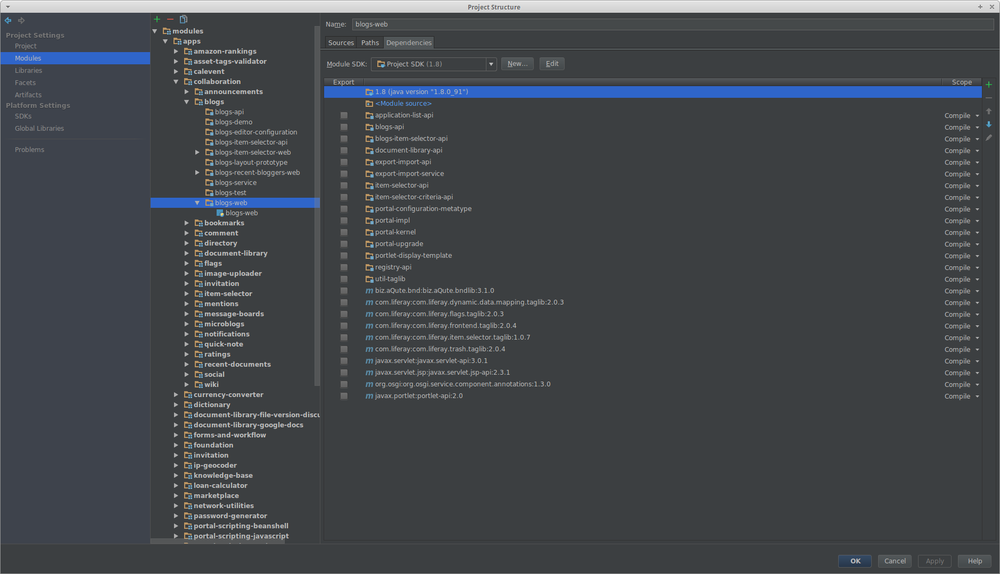
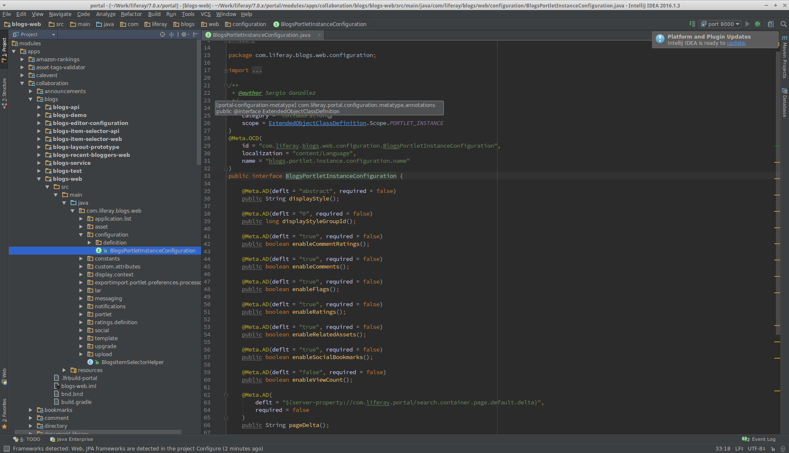
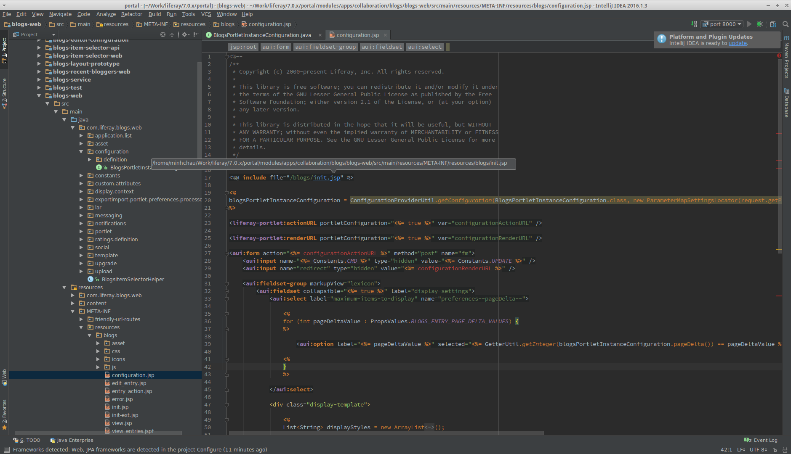

About the IntelliJ Modules Setup Script
=======================================

.. contents:: :local:

This script generates all the IML files, library descriptors, and the modules.xml file needed to have a complete Liferay project that successfully resolves imports in JSPs and Java files across the 1000+ modules in Liferay.

Screenshots of End Result
-------------------------

Screenshots can help clarify what the script does.

First, the module dependency structure created by the script. As noted in the NodeJS training that developed this script, libraries are converted into projects whenever possible, and tag libraries and web module dependencies (``frontend-taglib``) are converted into library dependencies to avoid a bug in IntelliJ's JSP handling.

Next, rather than having each module include every transitive dependency explicitly, the script wires the dependencies as Maven libraries, and then it builds out the descriptors for these Maven libraries and includes all of the dependencies explicitly there. This cleans up the dependency listing so that it more closely resembles the build.gradle.

.. image:: intellij2.png
   :height: 360
   :width: 480

And of course, the whole point of this is to get Ctrl+Click working and eliminate as much red in the source files as possible. The script automatically converts library style dependencies into project dependencies, allowing for Ctrl+Click navigation to work between modules. This shows a class in blogs-web knowing how to go to portal-configuration-metatype.

This is Ctrl+Click navigation working inside of JSPs.

IntelliJ recognizes tag libraries when we tell it where to find the TLD files, but not the variables that those tags inject. Thus the ``configurationActionURL`` and ``configurationRenderURL`` in this screenshot is in red. If anyone has any ideas on how to get that working (even if it's just the manual steps you perform in IntelliJ), please let me know!

Download Dependency Sources
---------------------------

The zip also contains a ``bin/pom.js`` script generates pom.xml files that list module library dependencies. Having these files allows you to use Maven to download sources for libraries that the modules use. If you'd prefer to have this always run, you can use the following Bash function for ``ij`` instead of the one specified previously.

.. code-block:: bash

	IJ_CLONE_PATH=/path/to/clone/location

	ij() {
		${IJ_CLONE_PATH}/intellij_libsources "$@"
	}

Additional Notes
----------------

This script comes from a training which taught Java 8 streams concepts using NodeJS. The training materials were originally written for `Sphinx <http://www.sphinx-doc.org/en/stable/>`__, so there's also some math expressions that assume MathJax, which isn't available on Github.

Random changes in Liferay's code base layout have broken the training a few times along the way, and so the code is structured to make it easier to maintain for training slides but in a way that may terrify experienced NodeJS developers.

Change Log
----------

This is a change log for when I started keeping track of the changes that were made.

* **2018-07-12**: Switch to the CDN, because Liferay will soon disable direct access to its public Maven repository
* **2018-03-07**: Allow passing ``--unzip=true`` as an argument to unzip existing binaries from a Tomcat bundle
* **2018-05-11**: Handle tag libraries that were added to ``src/main/resources/META-INF/resources`` instead of ``src/main/resources/META-INF``
* **2018-03-19**: Exclude Kotlin jars from ``gradlew`` library to avoid infinite indexing loop
* **2018-03-19**: Add spring facet detection
* **2018-03-09**: Force ``domutils`` transitive dependency to 1.7.0 to workaround potential call stack size exceeded error
* **2018-03-07**: Allow passing ``--unload=true`` as an argument to `unload modules <https://blog.jetbrains.com/idea/2017/06/intellij-idea-2017-2-eap-introduces-unloaded-modules/>`__ that aren't built as part of ``ant all``
* **2018-03-01**: Re-allow test plugins SDK portlets, add workaround for pom dependencies that no longer exist
* **2018-02-28**: Address regression issue where pom.js script stopped working
* **2018-01-31**: Allow multiple passes in order to fill in the Gradle cache
* **2018-01-26**: Improve pom.xml property value parsing
* **2018-01-24**: Avoid having different versions of the same JAR on the classpath (use a simple latest version check rather than true dependency resolution as an approximation)
* **2018-01-23**: Treat non-core project dependencies as transitive dependencies because a few modules (like portal-search) use them that way
* **2018-01-22**: If you set breakpoints, move the module higher in the module list to work around IntelliJ not knowing the web context path
* **2018-01-19**: Recognize Gradle string variables used as version dependencies
* **2018-01-11**: Process BOM dependencies so if invalid versions are specified in build.gradle, we use the ones from the BOM
* **2018-01-05**: Update test output folders to allow running unit tests from inside of IntelliJ
* **2017-12-28**: Restore Node.js 0.12.x compatibility in case you build `alloy-ui <https://github.com/liferay/alloy-ui>`__ from source and forget to switch back to a newer version of Node.js
* **2017-10-02**: Handle newly introduced portal-pre module folders
* **2017-09-27**: Handle content targeting repository cloned inside the plugins SDK
* **2017-09-06**: Better handling for libraries (remove duplicates, only prefer Maven folder over Gradle folder if it has .jars)
* **2017-09-05**: Only scan folders inside of modules/private when checking a folder holding a *-private branch, move subrepos to their own module group
* **2017-08-25**: Auto sync with upstream and checkout portal commit if running from master-private or 7.0.x-private worktree
* **2017-08-15**: Exclude portal modules if there is a module of the same name from a subrepo
* **2017-08-02**: Avoid adding jars for transitive com.liferay dependencies derived from pom.xmls
* **2017-07-26**: Fix handling of plugins SDK folders that are missing build.xml files
* **2017-07-25**: Fix handling of downloadable portal source bundles that are missing build.xml files
* **2017-07-07**: Process parent pom.xml files when generating library classpaths
* **2017-07-03**: Attempt to download anything missing from .gradle cache
* **2017-06-06**: Re-enable using global gradle cache in user home
* **2017-05-31**: Do not force test dependency to false if it's explicitly set as a test dependency in build.gradle
* **2017-05-17**: Fix Felix logger dependencies, switch library/project dependency ordering so that other OSGi imports still work
* **2017-05-17**: Fix Gradle wrapper detection for newer IntelliJ
* **2017-05-17**: Re-add support for archetype-resources projects (Java files only parse if you fix the class and package)
* **2017-05-01**: Use package.json as a marker for theme-only projects
* **2017-04-24**: Handle symlinks on Windows, don't skip over dependencies if we use string interpolation for version numbers
* **2017-04-12**: Convert library dependencies to project dependencies as long as there is no init.jsp, re-allow snapshot libraries, add resource-only folders like definitions and sql
* **2017-03-30**: When wiring libraries, check ``.gradle`` caches outside of the portal source folder
* **2017-03-30**: Process each block of if-statement dependencies, like ``portal-dao-db``
* **2017-03-29**: Fix handling of dependencies declared as a Maven path
* **2017-03-29**: Fix odd grouping issues when pointing to the ``liferay-gradle`` subfolder of ``liferay-blade-samples``
* **2017-03-05**: Group submodules based on the project path in ``gradle.properties``
* **2017-02-16**: Add development library to all test modules for Mockito, exclude archetype-resources modules
* **2017-02-15**: Simplify test dependencies detection to fix problems with ``test-util`` modules
* **2017-02-15**: Add tag libraries detected in modules to ``misc.xml``
* **2017-02-10**: Add Gradle wrapper as a dependency if detected (run ``ant setup-sdk`` beforehand)
* **2017-02-04**: Add plugins SDK dependency modules to projects to make it easier to use IntelliJ to update Loop
* **2017-01-08**: Recognize version control system root
* **2016-11-16**: Add support for Blade workspaces
* **2016-09-14**: Update subrepo detection to check ``mode=pull``
* **2016-09-03**: Fix project to library conversion when Liferay Gradle caches are not updated
* **2016-08-31**: Fix relationship between ``portal-test-integration`` and other modules
* **2016-08-29**: Add ``lib/portal/bnd.jar`` to development library (fixes ``portal-kernel`` services)
* **2016-08-19**: Ignore any module-like dependencies in development library (fixes ``WebKeys``)
* **2016-08-18**: Handle transitive dependencies (useful for test modules)
* **2016-08-15**: Make sure ``pom.xml`` files do not try to download portal sources
